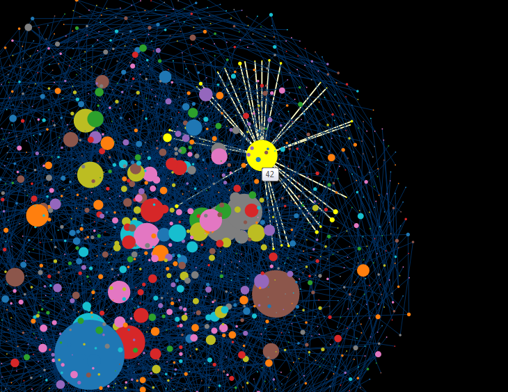

#Protein Interaction Network
##Description
***************

 &emsp;&emsp;&emsp;&emsp;&emsp;&emsp;&emsp;&emsp;&emsp;Figure 1

&emsp;&emsp;The Figure 1 shows the protein interaction network for yeast. As is known, proteins are traditionally identified on the basis of their individual action as catalysts, signaling molecules, or building blocks in cells and microorganisms. But post-genomic view is expanding the protein’s role into an element in a network of protein-protein interactions as well, in which it has a contextual or cellular function within functional modules. The data provided is to demonstrate the phenotypic consequence of a single gene deletion in the yeast Saccharomyces cerevisiae is affected to a large extent by the topological position of its protein product in the complex hierarchical web of molecular interactions.

&emsp;&emsp;Circles in the figure represent proteins and lines represent interactions between them. The larger of a circle means the more transmission of molecules with other proteins.
***************

 &emsp;&emsp;&emsp;&emsp;&emsp;&emsp;&emsp;&emsp;&emsp;Figure 2

&emsp;&emsp;When putting the mouse over a circle, the circles and lines having connections with it will be highlighted as we can see from Figure 2. Meanwhile, the ID of protein selected will show up. We believe that the visualization of protein interaction would provide with quantitative support for the research if more information of proteins and molecules can be obtained since we just have the IDs of proteins.
***************
##Design
&emsp;&emsp;We use d3 force-directed layout to realize the visualization and [text file data](bo.dat.gz.txt) is converted to json format using c++ with source file [TxtToJson.cpp](TxtToJson.cpp) at root dir.

