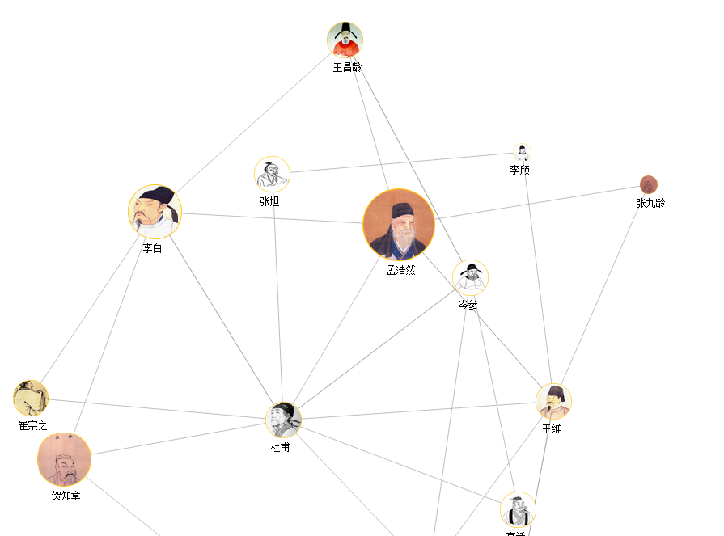
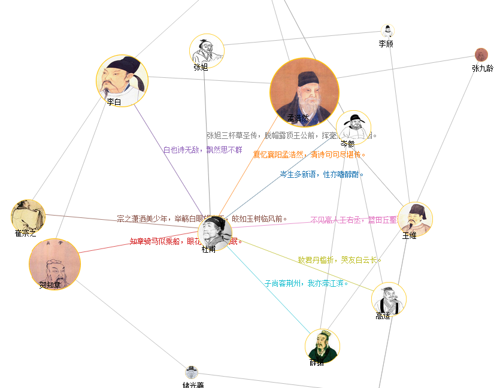

#The relationship between some famous poets in Tang Dynasty.
+ The Tang Dynasty produced a host of great poets, such as Li Bai, Du Fu and Wangwei.We have a great interest in the relationships between those famous poets in Tang Dynasty ,especially how they described their relationships in their poems.Therefore,by reading many poems or stories of these poets in Tang Dynasty, we try to find out if they know each other and the poems as a proof of their relationships.And the network graph below is the result of our work. 

###1. Data source: 
+ poems and the information gathered on Internet.
+ Because it is so difficult to gather information of all poets, we choose some of them.So we do not have many nodes in our graph. 

###2. Creation:
+ This project based on the example on wiki.

#### What's new:
+ a.The nodes will display an image now instead of a circle or rectangle.
+ b.Some text will show on the nodes.
+ c.Add some interactions:When the mouse point a node,some text will show beside the edges,some edges connect to the node         will change color and the image of the node and other nodes connect to the node will become bigger.

###3. Teammates:
+ 赵睿，张琦
