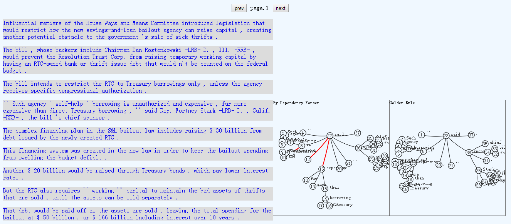
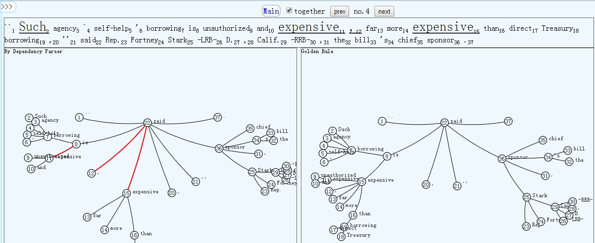
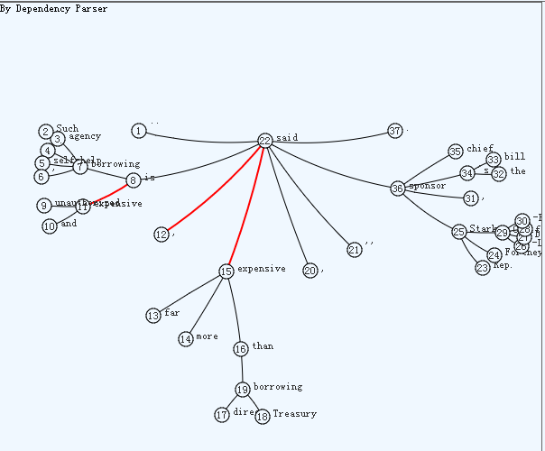
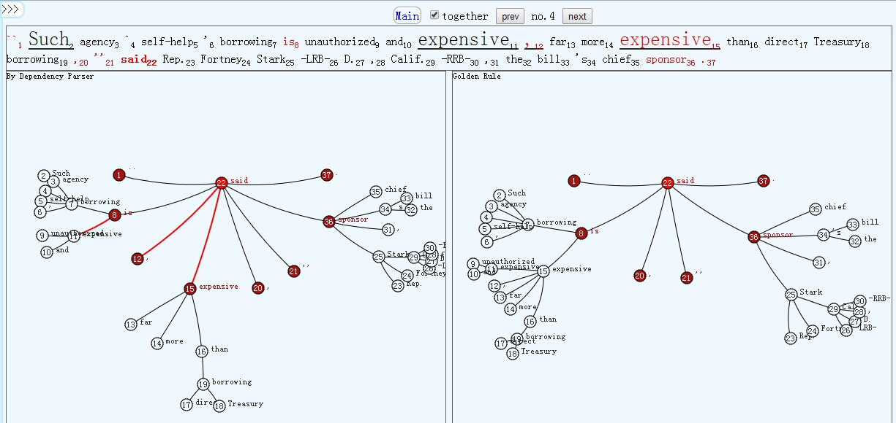
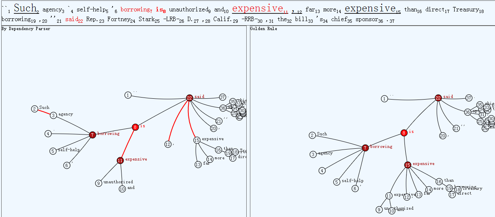

###dependency parsing visualization
Syntactic analysis is a key issue in the field of natural language processing, and Natural language processing is an important direction in the computer science field and artificial intelligence filed.Dependency grammar (DG) is a class of modern syntactic theories that are all based on the dependency relation.**The dependency relation views the (finite) verb as the structural center of all clause structure.**All other syntactic units (e.g. words) are either directly or indirectly dependent on the verb.I show the data of both golden rule and the parsing algorithm results.

From the picture above we can see many sentences, and I show the parsing tree which can be seen when the mouse is over any sentence. In this picture, I move the mouse over the forth sentence, and we can see two parsing trees, of them the left one is the result of parsing algorithm while the right one is the result of Golden Rule. In parsing tree, a node represents a word and the line between nodes represents the dependency relation. **We can easily see which dependency relation is wrong because I use red line to represent wrong relation. So we can compare the results of Golden Rule and parsing algorithm conveniently.**

We can click any sentence in picture 1 and see this page. In this picture, the top shows the whole sentence and the word whose dependency relation is wrong is underlined and bold.Both in the above sentence and the following parsing tree, the nodes and the words are marked serial number in sentence. I draw the parsing  tree by using a special tree called hyperbolic tree which can shift the focus, so we can see the part interested while other parts is not focused.We can see the detail in the following picture:

 

In this picture, I move the mouse over node 'said' in parsing tree.We can see both in the sentence and the parsing tree, the selected word and the related words are highlighted.From the top sentence, we can clearly see the dependency relations of the selected word in sentence. 

In this picture, I move mouse to change the focus and the node 'is' is selected. We can primarily see the dependency relation of 'is' while other parts of the parsing tree is nonsignificant.

###conclusion
There are many wrongs in dependency parsing algorithm results, and what I do is to help to improve the dependency parsing algorithm .Through comparing the Golden Rule results and the algorithm results by visualization, we can more conveniently find the wrongs than just comparing the text results.  
