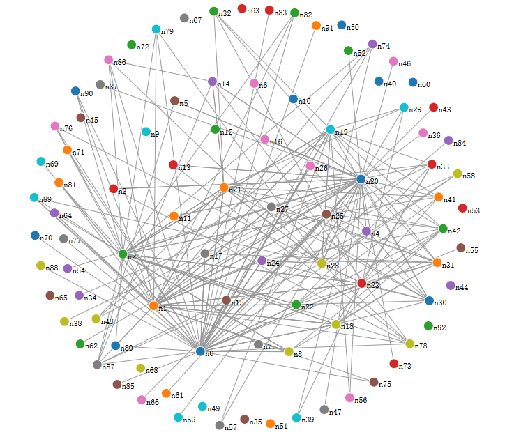
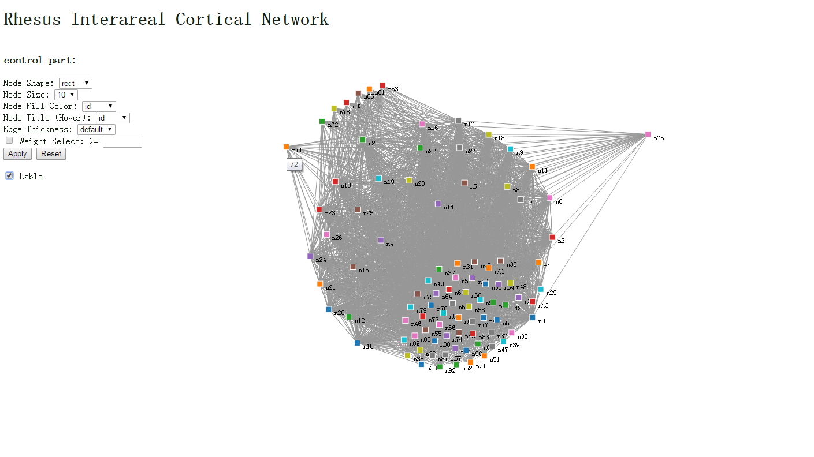

#rhesus_interareal.cortical.network

###1.Introduction
This visualization shows the relationships among different parts of a rhesus brain. Each part of the brain is abstracted into a node, and the ecological signals between them is their edges. We get the data from [MROCP](http://mrbrain.cs.jhu.edu/graph-services/download/). And visualize it with force lay-out. Several interactions is included to allow you to get closer to the data. We hope you like it.

###2.Dataset Discription
The dataset comes from MROCP(Magnetic Resonance One-Click Pipleline), which is an open source project that provides Web services to build and perform scientifically interesting computations on connectome and general graphs. The data contains 93 nodes and 2667 edges, both of them have several properties like id, weights, atc.  We download our data from [here](http://mrbrain.cs.jhu.edu/graph-services/download/). 

###3.What we do
We get the data in form of .dot, and translate it into json with [a java project](https://github.com/vis2014/Assignment2/tree/LiYuepei_WangHailu_A2/src). Force-directed lay-out is our choice to make the visualization more clear and interesting. Several interactions(like drag, click, selected and atc.) is involved. The visualization of whole data can be shown in the picture below. See more details, please click here() to see our assignment report on wiki.

###4.Contact us
Email: liyuepei14@mails.ucas.ac.cn
Copyright©2014 by LiYuepei & WangHailu.
